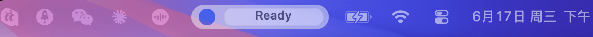
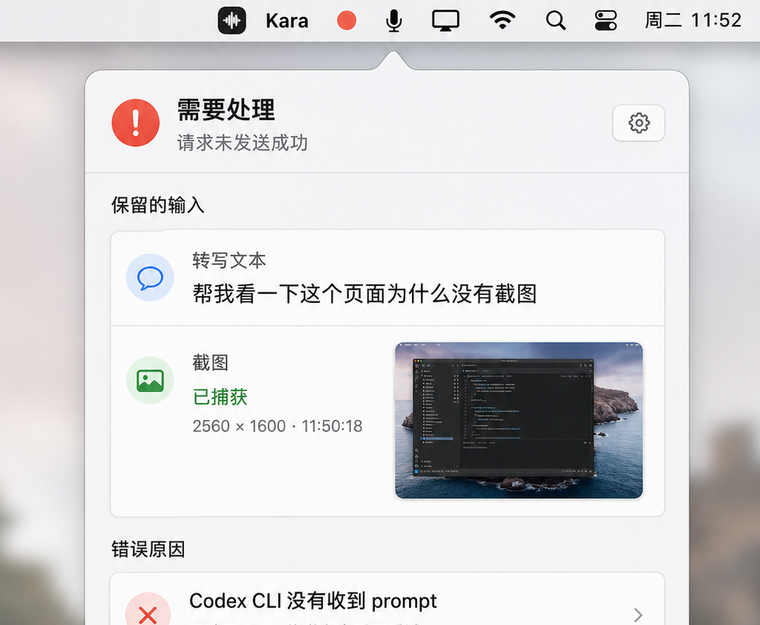
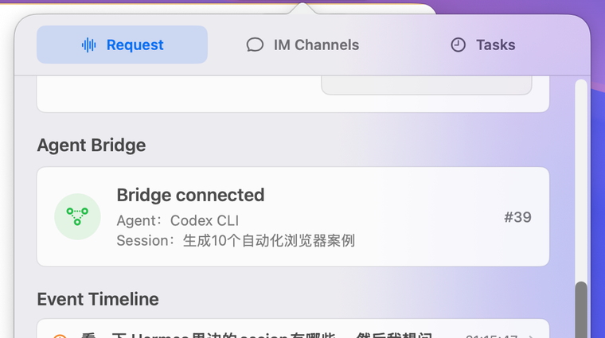

# Kara

Kara is a native macOS menu bar assistant for sending voice commands, with screen context, to local AI coding agents.

Hold the global hotkey, speak what you want, and Kara transcribes your speech, captures the current screen, then routes both through its Agent Bridge to a local agent such as Codex CLI, Claude CLI, or Hermes CLI.

## Screenshots

Kara stays visible as a compact menu bar status item:



The request panel keeps the retained transcript, screenshot context, bridge state, and recent bridge events in one place:

| Request context | Agent Bridge |
| --- | --- |
|  |  |

## What Kara Does

- Runs quietly in the macOS menu bar
- Records push-to-talk speech from the microphone
- Transcribes speech locally with Apple Speech APIs
- Captures the current screen at the start of each voice request
- Routes the transcript and screenshot through a long-running Agent Bridge
- Reuses the last successful agent/session unless the user switches target
- Persists bridge events to support replay and diagnostics
- Supports Codex, Claude, and Hermes command-line targets
- Lets you pick recent agent sessions when available
- Provides WeChat channel integration for forwarding messages
- Supports scheduled tasks that can run agent prompts on a cadence

## Agent Bridge

Kara uses an in-app Agent Bridge runtime between voice capture and CLI execution. The bridge owns:

- request turn lifecycle
- frontmost app and screenshot context capture
- agent/session routing
- monotonic event sequencing
- JSONL event log persistence under `~/Library/Application Support/Kara/Bridge`
- replay support for diagnostics and recovery
- last-successful target reuse

This keeps the normal workflow simple: speak first, switch Agent only when needed.

## Current Workflow

1. Choose an AI tool once, or let Kara pick the first available supported agent.
2. Grant microphone access and screen recording access when prompted.
3. Hold the voice hotkey and speak your request.
4. Release the hotkey to send the transcript plus screenshot through Agent Bridge.
5. Kara routes to the last successful agent/session by default.
6. If delivery fails, Kara keeps the transcript and screenshot so you can retry, edit, or switch Agent.
7. Kara shows delivery status in the menu bar and stores diagnostic logs under `~/Library/Logs/Kara`.

## Permissions

Kara needs these macOS permissions:

- Microphone: used for push-to-talk voice transcription.
- Speech Recognition: used by Apple's speech transcription APIs.
- Screen & System Audio Recording: used to capture the current screen as request context.

If screenshot requests fail, open System Settings and enable Kara under:

`Privacy & Security` -> `Screen & System Audio Recording`

After changing this permission, quit and reopen Kara so macOS applies the new authorization.

## Download

Download the latest DMG from:

https://github.com/section9-lab/Kara/releases/latest

## Build Locally

Kara is built with Swift, SwiftUI, AppKit, and ScreenCaptureKit.

```sh
xcodegen generate
xcodebuild -project Kara.xcodeproj -scheme Kara -configuration Debug build
```

To create a release DMG:

```sh
Scripts/package_dmg.sh
```

The DMG is written to `dist/Kara-<version>.dmg`.

## Signing Notes

Local builds use the signing settings in `project.yml`. The DMG packaging script also supports CI builds where a local Apple Development certificate is unavailable.

To override the signing identity for packaging:

```sh
CODE_SIGN_IDENTITY_OVERRIDE="Apple Development: Example (TEAMID)" Scripts/package_dmg.sh
```

## Release Process

Releases are published from GitHub Releases. The repository includes a GitHub Actions workflow that builds and uploads a DMG whenever changes land on `main`.
